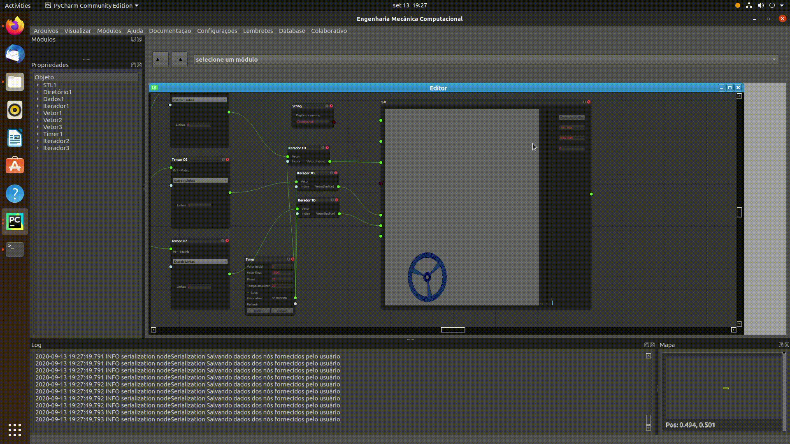

#  Engenharia Mecânica Computacional 

    STATUS: EM DESENVOLVIMENTO 

## Descrição do projeto

Este projeto constiste em desenvolver uma interface gráfica para facilitar a integração do projeto de máquinas e equipamentos.
Espera-se implementar rotinas comuns que auxiliem no desenvolvimento de projetos multidisciplinares.

Separar as rotinas em módulos para melhorar a organização do programa.

## Documentação 
<a href="https://github.com/rkavenaghi/MecEngCom/wiki/P%C3%A1gina-Inicial"> Wiki</a>


### Demo
Análise do conteúdo harmônico da resposta ao impulso do sistema massa mola-amortecido de um grau de liberdade.

 Figura 1: Demonstraçao do software. 



Vídeo 2: Utilizando dados extenos da dinâmica do pêndulo com roda de reação para visualizar o movimento dos arquivos STL.

## Instalação

#### Criar uma pasta usando virtualenv


Para instalar as dependências do projeto, deve-se ter o PIP instalado. Entre no diretório que descompactou o arquivo, e escreva o
 comando no terminal.
```
pip install -r requirements.txt
```
Executando este comando, todas as dependências necessárias para rodar o projeto devem funcionar.

## Mural para desenvolvimento

#### Update 11/11/2020

    > Modificação da representação de Álgebra somatório para um Nó com entradas positivas e negativas. 
        > Avaliar se comportamento para múltiplas entradas. 
        > Avaliar para tipos de dados diferentes de escalares.


### Ferramentas de Análise
    > Implementar Vibrações para Sistemas com Múltiplos Graus de Liberdade;
    > Implementar Análise de Autovalores e Autovetores de Matrix em Álgebra;
    > Implementar a Análise de Mecanismos de topologia arbitrária.
    
    
    #### Feito
    	> Iterador de listas e np.arrays; 

### Colaborativo
    > Implementar um chat com usuários de um mesmo projeto;
    > Implementar o gerenciamento das tarefas;
        > Designação de tarefas;
        > Hierarquia de modificação de arquivos;
    > Implementar o envio de arquivos para o chat para outros carregarem e utilizar.
    
### Integração com outros dispositivos
    > Visualização do projeto em periféricos celular/tablet Android;
    > Edição de dados;
    > Envio para análise em nuvem;
    > Obter resultados da nuvem.
    
### Funcionalidade
    > Melhorar a funcionalidade de REDO e UNDO;
    > Implementar console Python integrado no App;
    > Estúdio para criação de Nós com interfrace gráfica;
   
    
    
    


